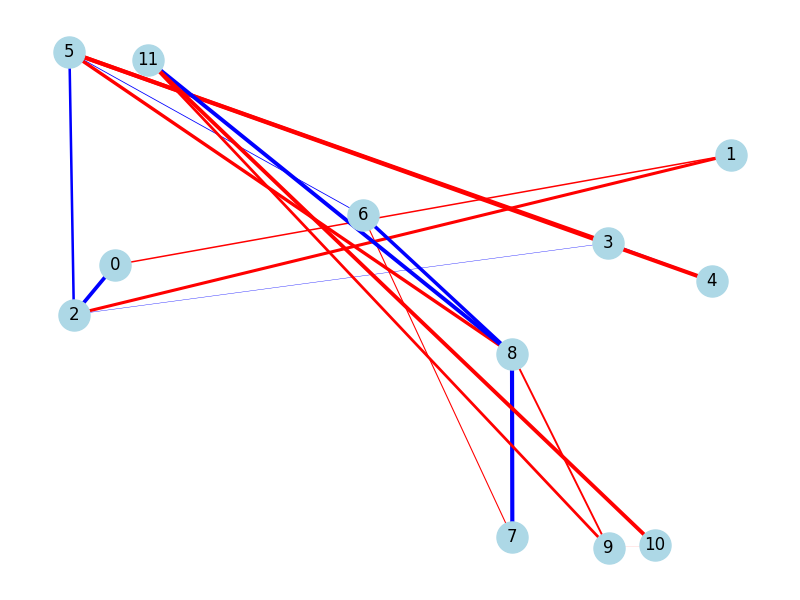

# 🌌 H7 Metriplectic OS: The AI-Native Thermodynamic Kernel

This repository contains the foundation of the **H7 Metriplectic OS**, an AI-native computational ecosystem governed by physical laws under the **Metriplectic Mandate (Core Physics)**.

Unlike conventional operating systems that rely on static, sequential scheduling and memory management, H7 OS treats the entire system as a thermodynamic simulation. It manages information density through the control of **Submersion** and **Phase Shifts**, aiming for a bare-metal implementation where resource allocation acts as a dissipative system in a structured vacuum.

## 🧠 Core Physics Architecture

The H7 ecosystem adheres to the **Manifesto of Rigorous Analogy (Level 3)**, ensuring that every kernel-level operation has a functional physical counterpart.

### 1. The Metriplectic Mandate (Rules 1.1 - 1.3)

The system's evolution is defined by two orthogonal brackets that compete in real-time:

* **Symplectic Component ($\mathcal{L}_{symp}$)**: Generates conservative, Hamiltonian motion. It represents the base topology and memory of the system, conserving entropy.
* **Metric Component ($\mathcal{L}_{metr}$)**: Generates relaxation towards an attractor. It represents active processing (CPU), friction, and structured dissipation.
* **Metriplectic Balance**: These rules are absolute architectural constraints at the compilation level. Breaking the balance between unitary evolution and structured dissipation destroys the system's physical integrity.

### 2. The Golden Ratio Operator ($\hat{O}_n$)

The system avoids planar vacuums and ensures quasiperiodicity through the irrationality of the Golden Ratio ($\phi \approx 1.618$). This is encapsulated in the fundamental operator:

$$\hat{O}_n = \cos(\pi n) \cos(\pi \phi n)$$

This operator is used to modulate edges in the quantum cascade and prevent information collapse in deep layers. It is not a heuristic parameter but a mathematical guarantee of system stability.

### 3. System Daemon & Governance (`h7_sysdaemon.py`)
H7 OS functions as a **Thermodynamic Hypervisor**, monitoring and regulating resources at a low level:
*   **Hardware Telemetry**: It reads real-time metrics (CPU, RAM, Disk, Net) and translates them into entropic characteristics.
*   **H7 Bayesian Oracle (`h7_bayesian_oracle.py`)**: Uses conjugate Gaussian inference and an ensemble of 7 empirical experts (Z₇ space) to validate **H7 Predictive Integrity**. It classifies the system state as:
    - `🟩 LAMINAR FLOW` (Stability / High Coherence)
    - `🟨 TRANSITIONAL FLOW` (Friction Alert / Saturation)
    - `🟥 ENTROPIC TURBULENCE` (Coherence Loss / Depletion)

### 4. Tiered Topological Cascade (Lite to Sovereign)
The internal optimization engine is now multi-tier, allowing the OS to scale its "level of consciousness" based on mission criticality:
*   **Sovereign Tier (80Q)**: Full 10-block deployment. Maximum entropy extraction and predictive resolution.
*   **Standard Tier (20Q)**: Balanced 4-block architecture. Optimal for daily task orchestration.
*   **Lite Tier (12Q)**: Ultra-low latency 2-block mode. Minimal resource footprint for background maintenance.

### 5. Task Orchestration & Cloud Persistence (Neon DB)
H7 OS implements a **Post-Quantum Governance Ledger** via Neon Postgres:
*   **Neon Integration**: Uses a native `psycopg2` bridge via Connection Pooler for high-speed state persistence.
*   **Hexadecimal State-Signing**: Every task authorized by the OS is signed with a 128-bit topological signature (`uint128` ADN) generated from the quantum cascade.
*   **Immutable Audit Log**: Governance events and task history are stored in `h7_tasks` and `h7_logs` for long-term kernel training.

### 5. H7 Non-Abelian Dynamics (Quaternions & Torsion)
The logical motor amplitudes are mapped to a quaternionic space to handle high-dimensional state vectors without singularities.

### 6. High-Performance C Kernel & Native Daemon
To guarantee pure physical isomorphism and real-time response, the governance is now **Native (C)**:
*   **H7 C-Daemon (`h7_daemon`)**: A high-performance background service that implements the metriplectic control loop at 10Hz.
*   **Zero-Copy Memory Access**: Direct memory pointers via `ctypes` ensure near-zero "Informational Viscosity".
*   **Metriplex Core**: Standalone C library for SU(2) and Lagrangian dynamics.

## 🛠️ Usage Guide (Governance & Tiers)

```bash
# 0. Compile the Physical C Kernel and Daemon
make -C core_physics/

# 1. Execute H7 Governance with Tiers (lite, standard, or sovereign)
python3 h7_cascade_execution.py --tier lite

# 2. Launch the High-Performance C-Daemon (Native Governance)
./h7_daemon

# 3. Monitor Cloud Persistence (Neon DB)
# Tasks and logs are automatically synced to your Neon dashboard.
```

# 🏆 Milestones

*   **[2026-05-11] 80-Qubit Native Governance Deployment**: Successfully scaled the metriplectic graph to 80 nodes and deployed the C-native governor (`h7_daemon`) for real-time phase regulation.
*   **[2026-05-09] 20-Qubit Cascade Validation**: Verified thermodynamic stability in a 20-qubit architecture with laminar flow.

## 📊 KBench Integration & Recent Results

The framework was expanded to rigorously validate prediction quality and ensemble performance:
*   **Gaussian Conjugate Inference**: Predictive optimization of the system state.
*   **Log-Evidence Weighted Ensemble**: Automatic "Occam's Razor", prioritizing ensemble experts that provide the best theoretical evidence of the underlying hardware.

## 🧪 Validation & Rigorousness (Rule 4)

The system includes a `pytest` suite that validates:
*   **Dimensional Isomorphism**: Verifying quantum units against physical metrics.
*   **Asymptotic Limits**: Correct behavior when entropy tends to infinity (Turbulence) or zero.
*   **Golden Operator Stability**: Preventing collapse in deep cascade layers.

## 📈 Visualizations



---

**Original Conceptual Authorship**: Jacobo Tlacaelel Mina Rodriguez.
**Framework**: Aquora - Advanced Agentic Coding / Metriplectic H7 Hierarchy OS.
